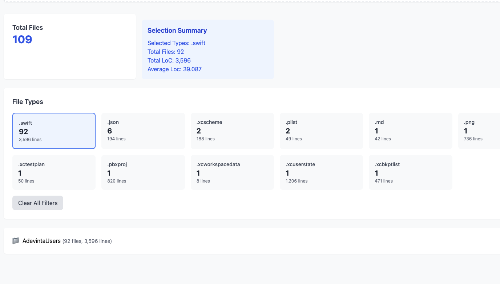

# Adevinta Random User Exercise 

## Summary
The exercise has been completed with all requirements met + some extras

## Project Details
- 3 Targets used:
    - AdevintaUsersTests - 53 unit tests
    - AdevintaUsersUITests ( not used)
    - AdevintaUsersIntegrationTests - integration tests for testing the api endpoint live
- 2 Schemes: 
    - AdevintaUsersTests 
    - AdevintaUsersIntegrationTests  
    

## Key Metrics 
- Total Swift files: 86
- Lines of code (LoC): 2970
- Average LoC: 42
- 54 unit tests PASSING
- 100 % logic code test coverage, ( 79% including Views)

## Technical Details
- Application implemented in **Swift 6** with full concurrency support  
- Implemented *Nice to have* features
- Implemented extra Toolbar feature:
    - **ANY/ALL term search** triggered when typing a search text
    - Duplicates button that present a modal view
    - Blacklist button  that present a modal view
    - User counter that is 
- Development primarily followed **Test-Driven Development (TDD)** methodology
- Integration of the latest **Swift Testing library** with modern feature utilization  
- Implementation follows **Clean Architecture** and **SOLiD** principles 
- Modular design with clear layer separation, prepared for **SPM binary modularization**

## Implementation Notes and Conclusion
- Data persistence implemented through **UserDefaults** for development purposes (*not efficient for production*)  
- Improvements can be done profiling the main operations
- A more thoughrough  end to end test should be done 
